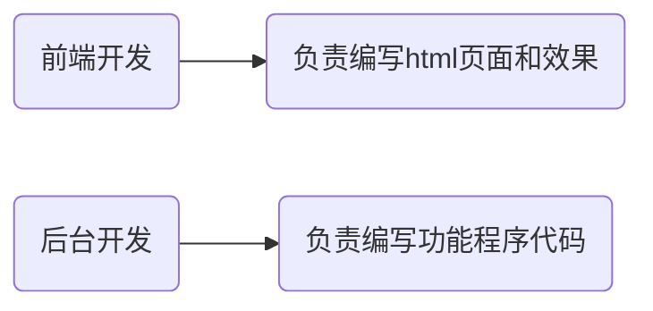

# 一、昨日回顾

## 1. 知识回顾

1. 连库基本操作？

   通过实例化PDO类的对象来实现连库的基本操作。

   ```php
   $dsn = 'mysql:host=localhost;port=3306;charset=utf8;dbname=test';
   $obj = new PDO($dsn, 'root', '123abc');
   ```
<!-- more -->
2. 设置操作（增删改）操作？

   通过PDO类中的exec的方法来实现增删改操作。

   ```php
   $dsn = 'mysql:host=localhost;port=3306;charset=utf8;dbname=test';
   $obj = new PDO($dsn, 'root', '123abc');
   
   #增删改操作
   //构建SQL语句
   $sql = '增/删/改的SQL语句';
   //执行SQL语句
   $re = $obj->exec($sql);
   
   //判断执行的结果
   if($re){//表示如果执行成功
       
       //给出提示
   }else{//表示执行失败
       
       //给出提示
   }
   ```

3. 查询操作？

   1. 首先通过PDO类中的query的方法来执行查询SQL语句

      ```php
      $dsn = 'mysql:host=localhost;port=3306;charset=utf8;dbname=test';
      $obj = new PDO($dsn, 'root', '123abc');
      
      #执行查询操作
      //构建SQL语句
      $sql = '查询SQL语句';
      //执行SQL语句   如果执行成功则返回 一个对象类型的结果集；如果执行失败则返回false
      $pdostatement = $obj->query($sql);
      
      //如果执行成功则需要进一步解析对象类型的结果集
      /*
      $pdostatement->fetch(PDO::FETCH_ASSOC);//执行一次获取一条数据
      参数：
      PDO::FETCH_ASSOC      表示获得的数据是一个关联类型的数组
      PDO::FETCH_NUM       表示获得的数据是一个索引类型的数组
      PDO::FETCH_BOTH       表示获得的数据是一个即包含关联类型又包含索引类型的数组
      PDO::FETCH_OBJ       表示获得的数据是一个对象类型的数据
      
      $pdostatement->fetchAll(); //执行一次获取所有数据，得到的数据是一个二维数组，默认情况下既包含关联类型的元素又包含索引类型的元素。
      
      */
      ```

      

4. PDO中的异常处理？

   1. 就是去获取执行SQL语句时出现的错误的错误信息。

      ```php
      $dsn = 'mysql:host=localhost;port=3306;charset=utf8;dbname=test';
      $obj = new PDO($dsn, 'root', '123abc');
      
      #开启错误处理模式为异常模式
      $obj->setAttribute(PDO::ATTR_ERRMODE, PDO::ERRMODE_EXCEPTION);
      
      $sql1 = '增/删/改SQL语句';
      $sql2 = '查询SQL语句';
      
      try{#使用try结构监听可能出错的执行语句
          
          $obj->exec($sql1);//监听执行增删改语句的操作
          $obj->query($sql2);//监听执行查询语句的操作
      }catch(PDOException $err){
          
          echo $err->getMessage();//获得错误的错误信息
          echo $err->getLine();//获得出错的行号
          echo $err->getCode();//获得错误的错误码值
          echo $err->getFile();//获得执行出错的文件全路径地址
      }
      ```


# 二、知识路径

- SMARTY模板技术基本概念

  ​	为什么使用SMARTY模板技术

  ​	什么是SMARTY模板技术

  ​	SMARTY模板引擎技术的特点

  ​	SMARTY模板技术实现的基本原理

  ==目标：了解什么是模板技术==

- SMARTY部署

  ​	SMARTY模板编译的原理

  ==目标：能够部署SMARTY==

- SMARTY程序设计

  ​	SMARTY属性设置

  ​		定界符

  ​		目录设置

  ​		常量设置

- SMARTY模板设计

  ​	SMARTY模板注释

  ​	SMARTY模板变量

  ​	SMARTY系统变量

  ​	SMARTY内置函数（内建函数）

  ​	SMARTY变量调节器

  ==目标：能够使用SMARTY将数据展示到html模板页面中==

  

# 三、今日课程内容：SMARTY模板技术

## 1. SMARTY模板技术基本概念

### 为什么使用SMARTY模板技术

在web项目开发中，程序通常可以分为html模板页面和php程序页面，理想状态下，前端开发者负责编写html模板页面；而后台开发者负责编写php功能程序页面；



但是，由于长期以来人们为了追求开发的便利性，经常是将html代码与php程序代码混合编写，这样的方式其实并不利于分工合作。

比如当我需要对现有页面进行改版，前端人员由于不懂PHP程序，只能先写好HTML页面模板，再交给后台开发人员重复一次以前嵌套PHP程序的工作。

 

而SMARTY模板技术，却很好的==将前端html代码==与==程序PHP代码==进行的==分离==，让前端开发者可以专心于开发前端的代码，而不必理会PHP程序；同时也让PHP程序开发者能够专注于PHP代码的构建，而不必为将数据嵌套进前端页面而烦恼。


### 什么是SMARTY模板技术

SMARTY模板技术是众多模板技术中的一种，而模板技术是一种将HTML代码和PHP代码强制分离的模板机制，它通过了某种方式让HTML代码与PHP代码在一起编写的过程中实现了强制分离。


所以SMARTY模板技术也就是：**一种将HTML代码和PHP代码强制分离的模板机制。**


### SMARTY模板技术的特点

SMARTY模板技术的主要特点：

> 1. smarty是一个基于==PHP开发==的PHP模板引擎，由于采用PHP编写，所以语法结构与PHP基本类似，语句比较自由；
> 2. 相对其他的模板引擎，具有更快的响应速度（速度快）；
> 3. Smarty插件非常灵活，可以任意的扩展；
> 4. 也有==不适合使用Smarty的地方==，比如一些需要==实时更新==的项目（股票的走势），因为Smarty把数据都缓存起来了，没法实时更新！

 

各框架和开源系统模板引擎使用一览：

>  ThinkPHP框架（引入了模板引擎技术）
>
> CI、YII（引入了模板引擎技术）
>
> DEDECMS（引入了模板引擎技术）
>
> ECSHOP（引入了模板引擎技术，使用的就是smarty模板引擎）


### SMARTY模板技术实现的基本原理

**==需求==**：封装一个名为smarty1的类，实现通过该类展示模板页面并输出数据到页面的效果。

**==解答==**：

构建名为Smarty1.class.php的程序文件，代码如下：

```php
class Smarty1{

    private $data=array();

    public function assign1($name, $val){ 
        
        //   $this->data['title'] = '劝学';
        $this->data[$name] = $val;//往$data属性中添加一个数组元素
    }

    public function display1($filePath){ 
        
        //print_r( $this->data ); 

        $content = file_get_contents($filePath);//读取模板文件中的内容

        //$content = str_replace('{title}', $this->data['title'], $content);
        //$content = str_replace('{auth}', $this->data['auth'], $content);
        //$content = str_replace('{date}', $this->data['date'], $content);
        //$content = str_replace('{content}', $this->data['content'], $content);
        foreach( $this->data as $k=>$v ){ 
            
            $content = str_replace('{'.$k.'}', $v, $content);//替换读取模板文件中占位符的内容
        }
        
        echo $content;//输出替换占位符之后的内容
    }
}


$title = '劝学';
$auth = '荀子';
$date = '公元前....年';
$content = '故不积跬步，无以至千里.....';

$smarty = new Smarty1;

$smarty->assign1('title', $title);
$smarty->assign1('auth', $auth);
$smarty->assign1('date', $date);
$smarty->assign1('content', $content);

$smarty->display1('./index.html');
//$smarty->display1('./index1.html');
```


**==小结==**：模板技术实现的原理即：==读取，替换，输出==；


## 2. ==SMARTY部署==

SMARTY并不是PHP本身就自带的，在使用之前，需要先进行部署。


**==步骤==**：

第一步，首先下载SMARTY，www.smarty.net，然后解压压缩包，


第二步，将SMARTY的核心类库文件夹复制一份，


粘贴到code/demo目录中，并且改名为smarty


第三步，在code/demo目录中，创建一个名为templates的目录，


smarty目录中的文件基本说明：


第四步，在demo目录中创建名为index1.php的程序文件，代码内容如下


访问index1.php文件，


### SMARTY模板编译的原理

当我们首次访问网站的某个页面时，SMARTY会自动在项目的smarty核心库目录同级的目录中创建一个名为templates_c的目录，这个目录存放的就是SMARTY的模板编译缓存文件。

 

SMARTY有一个机制，如果第一次访问某个模板页面时，则会自动创建一个该模板页面对应的编译缓存文件；以后再来访问该页面，则SMARTY会判断该模板页面是否已经发生改变，如果没有发生改变，则直接去访问编译缓存文件，如果发现模板内容有被改变，则重新编译生一个新的缓存文件，覆盖老的缓存文件。


**==测试1==**：测试首次访问一个模板页面，观察是否生成对应的编译缓存文件。


从测试的效果上看，首次访问将会生成一个编译缓存文件。

**==测试2==**：打开已经生成的编译缓存文件，输出"哈哈"，观察再次访问相同的页面时，是否会输出"哈哈"。


**==测试3==**：改变模板文件的内容，再次访问此页面，观察是否还会访问之前的缓存文件输出缓存文件中的"哈哈"。


**==小结==**：

当首次访问程序时，将会生成一个编译缓存文件，同时记录下该模板文件的最后修改时间；以后当再次访问相同的页面时，将会匹配一下模板文件的最后修改时间，如果发现之前记录的最后修改时间和当前实际的最后修改时间不一样，将会重新执行一次完整的程序，生成新的编译缓存内容，覆盖掉老的编译缓存内容；如果发现时间一致，那么将不会再去完整的执行一次程序，而是直接去走编译缓存文件，将编译缓存文件中的内容响应给浏览器展示。

### SMARTY模板技术分类

SMARTY模板技术有两个分类：1）程序设计；2）模板设计；


## 3. SMARTY程序设计

### SMARTY属性设置

#### 定界符

在模板当中包裹SMARTY语句的符号，即定界符。

默认的==左==定界符：**=={==**

默认的==右==定界符：**==}==**


我们可以通过SMARTY对象中的两个属性修改定界符

> left_delimiter非静态属性          负责控制左定界符
>
> right_delimiter非静态属性      负责控制右定界符


**==需求==**：测试修改默认的左定界符为"{--"，右定界符为"?}"，查看页面访问效果。

**==解答==**：构建名为index2.php文件，代码如下：

```php
<?php

#引入SMARTY3.0核心类库文件
include './smarty/Smarty.class.php';

#基于Smarty类创建对象
$smarty = new Smarty;

//修改左定界符
$smarty->left_delimiter = '{--';
//修改右定界符
$smarty->right_delimiter = '?}';

$title = '劝学';
$auth = '荀子';
$date = '公元前....年';
$content = '故不积跬步，无以至千里.....';

//分配模板变量
$smarty->assign('title', $title);
$smarty->assign('auth', $auth);
$smarty->assign('date', $date);
$smarty->assign('aa', $content);

//渲染模板
$smarty->display('index2.html');
```

构建名为index2.html文件，代码如下：

```html
<!DOCTYPE html>
<HTML>
<head>
    <meta charset="UTF-8">
    <title>主页</title>
</head>
<body>
    <p>
		<span>标题：</span>{--$title?}adsfadsadsfsadfadsfadsfasdsadfads
	</p>

	<p>
		<span>作者：</span>{--$auth?}
	</p>

	<p>
		<span>发布时间：</span>{$date}
	</p>

	<p>
		{$aa}
	</p>
</body>
</HTML>
```

访问效果：


**==小结==**：我们可以通过left_delimiter来修改左定界符；通过right_delimiter来修改右定界符；


#### ==目录设置==

在Smarty3.0以后的版本，我们可以调用Smarty对象的方法修改模板目录和编译缓存目录：

> setTemplateDir()   修改模板目录
>
> setCompileDir()    修改编译目录


**==需求1==**：在code/demo目录下创建名为view的目录，将存放模板文件的目录修改为code/demo/view目录，测试效果。

**==解答1==**：在code/demo下创建view目录：


创建code/demo/index3.php文件，代码如下：

```php
<?php

#引入SMARTY3.0核心类库文件
include './smarty/Smarty.class.php';

#基于Smarty类创建对象
$smarty = new Smarty;

#修改存放模板目录的文件夹位置
$smarty->setTemplateDir('./view');

$title = '劝学';
$auth = '荀子';

//分配模板变量
$smarty->assign('title', $title);
$smarty->assign('auth', $auth);

//渲染模板
$smarty->display('index3.html');
```

创建code/demo/view/index3.html文件，代码如下：

```html
<!DOCTYPE html>
<HTML>
<head>
    <meta charset="UTF-8">
    <title>主页</title>
</head>
<body>
    <p>
		<span class='s1'>标题：</span>{$title}adsfadsadsfsadfadsfadsfasdsadfads
	</p>

	<p>
		<span>作者：</span>{$auth}
	</p>

</body>
</HTML>
```

访问index3.php效果：


**==小结1==**：

1. 必须手动创建一个存放模板文件的目录，比如当前创建了一个名为view的目录；
2. 然后在程序中通过Smarty类的对象去调用setTemplateDir修改存放模板文件的目录路径为上一步创建出来的那个目录；


**==需求2==**：在程序中将存放编译缓存文件的目录修改为code/demo/view_c目录，测试效果。

**==解答2==**：在code/demo下创建view目录：


创建code/demo/index4.php文件，代码如下：

```php
<?php

#引入SMARTY3.0核心类库文件
include './smarty/Smarty.class.php';

#基于Smarty类创建对象
$smarty = new Smarty;

#修改存放模板目录的文件夹位置
$smarty->setTemplateDir('./view');

#修改存放编译缓存文件的目录
$smarty->setCompileDir('./view_c');

$title = '劝学';
$auth = '荀子';

//分配模板变量
$smarty->assign('title', $title);
$smarty->assign('auth', $auth);

//渲染模板
$smarty->display('index4.html');
```

创建code/demo/view/index4.html文件，代码如下：

```html
<!DOCTYPE html>
<HTML>
<head>
    <meta charset="UTF-8">
    <title>主页</title>
</head>
<body>
    <p>
		<span class='s1'>标题：</span>{$title}adsfadsadsfsadfadsfadsfasdsadfads
	</p>

	<p>
		<span>作者：</span>{$auth}
	</p>

</body>
</HTML>
```

访问后效果：


**==小结2==**：

1. 直接在程序中使用Smarty类的对象调用setCompileDir方法修改指定的目录路径存放编译缓存文件，比如上面的案例中我们设置为一个叫view_c的名字。那么以后当访问程序时，将会自动创建一个名字叫view_c的目录。


## 4. SMARTY模板设计

### ==SMARTY模板注释==

语法：==**{\***注释内容***}**== 


**==测试==**：创建code/demo/index6.php文件，代码如下：

```php
<?php

#引入SMARTY3.0核心类库文件
include './smarty/Smarty.class.php';

#基于Smarty类创建对象
$smarty = new Smarty;

$title = '劝学';
$auth = '荀子';

//分配模板变量
$smarty->assign('title', $title);
$smarty->assign('auth', $auth);

//渲染模板
$smarty->display('index6.html');
```

创建code/demo/templates/index6.html文件，代码如下：

```html
<!DOCTYPE html>
<HTML>
<head>
    <meta charset="UTF-8">
    <title>主页</title>
</head>
<body>
	<!-- 这是HTML的注释 -->
	{*这是SMARTY的注释*}
    <p>
		<span class='s1'>标题：</span>{$title}adsfadsadsfsadfadsfadsfasdsadfads
	</p>

	<p>
		<span>作者：</span>{$auth}
	</p>
</body>
</HTML>
```


**==小结==**：SMARTY的注释内容在浏览器中是无法看到的。


### ==SMARTY模板变量==

SMARTY模板变量包括三个种类：1）简单模板变量；2）数组模板变量；3）对象模板变量；

#### ==简单模板变量==

概念：即分配的数据为标量数据类型的变量；


**==测试==**：创建code/demo/index7.php文件，代码如下：

```php
<?php

#引入SMARTY3.0核心类库文件
include './smarty/Smarty.class.php';

#基于Smarty类创建对象
$smarty = new Smarty;

$title = '劝学';
$auth = '荀子';
$age = 20;

//分配模板变量
$smarty->assign('title', $title);
$smarty->assign('auth', $auth);
$smarty->assign('age', $age);

//渲染模板
$smarty->display('index7.html');
```

创建code/demo/templates/index7.html文件，代码如下：

```html
<!DOCTYPE html>
<HTML>
<head>
    <meta charset="UTF-8">
    <title>主页</title>
</head>
<body>
    <p>
		<span class='s1'>标题：</span>{$title}adsfadsadsfsadfadsfadsfasdsadfads
	</p>

	<p>
		<span>作者：</span>{$auth}
	</p>

	<p>
		<span>作者年龄：</span>{$age}  {$age} 
	</p>
</body>
</HTML>
```

访问后效果：


**==小结==**：通过assign方法分配给模板的变量保存的是一个标量类型的数据，我们就成为简单模板变量。


#### ==数组模板变量==

概念：即分配的数据为数组数据类型的变量；


**==测试==**：创建code/demo/index8.php文件，代码如下：

```php
<?php

#引入SMARTY3.0核心类库文件
include './smarty/Smarty.class.php';

#基于Smarty类创建对象
$smarty = new Smarty;

$title = '劝学';
$auth = '荀子';
$arr = ['芝士龙虾', '麻辣小龙虾', 'cai3'=>'白灼皮皮虾'];

//分配模板变量
$smarty->assign('title', $title);
$smarty->assign('auth', $auth);
$smarty->assign('aa', $arr);

//渲染模板
$smarty->display('index8.html');
```

创建code/demo/templates/index8.html文件，代码如下：

```html
<!DOCTYPE html>
<HTML>
<head>
    <meta charset="UTF-8">
    <title>主页</title>
</head>
<body>
    <p>
		<span class='s1'>标题：</span>{$title}adsfadsadsfsadfadsfadsfasdsadfads
	</p>

	<p>
		<span>作者：</span>{$auth}
	</p>

	<p>
		<span>菜1：</span>{$aa[0]}
	</p>

	<p>
		<span>菜2：</span>{$aa[1]}  {$aa.1}
	</p>

	<p>
		<span>菜3：</span>{$aa['cai3']}  {$aa.cai3}
	</p>

</body>
</HTML>
```

访问后效果：


**==小结==**：通过assign方法分配给模板的变量保存的是一个数组数据。


#### ==对象模板变量==

概念：即分配的数据为对象数据类型的变量；


**==测试==**：创建code/demo/index9.php文件，代码如下：

```php
<?php

#引入SMARTY3.0核心类库文件
include './smarty/Smarty.class.php';

#基于Smarty类创建对象
$smarty = new Smarty;

$title = '劝学';
$auth = '荀子';

class Cai{

    public $cai1='蚂蚁上树';
    public $cai2='红烧铁狮子头';
    public $cai3='宫保鸡丁';

    public function selfCai($name){ 
        echo $name;
    }
}

$obj = new Cai;
var_dump( $obj ); 

//分配模板变量
$smarty->assign('title', $title);
$smarty->assign('auth', $auth);
$smarty->assign('aa', $obj);

//渲染模板
$smarty->display('index9.html');
```

创建code/demo/templates/index9.html文件，代码如下：

```html
<!DOCTYPE html>
<HTML>
<head>
    <meta charset="UTF-8">
    <title>主页</title>
</head>
<body>
    <p>
		<span class='s1'>标题：</span>{$title}adsfadsadsfsadfadsfadsfasdsadfads
	</p>

	<p>
		<span>作者：</span>{$auth}
	</p>

	<p>
		<span>菜1：</span>{$aa->cai1}
	</p>

	<p>
		<span>菜2：</span>{$aa->cai2}
	</p>

	<p>
		<span>菜3：</span>{$aa->cai3}
	</p>

	<p>
		<span>自定义菜：</span>{$aa->selfCai('全家桶')}
	</p>

</body>
</HTML>
```

访问后效果：


**==小结==**：通过assign方法分配给模板的变量是一个对象类型的数据。


### ==SMARTY系统变量==

SMARTY系统变量有：

> ==**{$smarty.get.变量名称}**==    直接获取GET参数数据
>
> ==**{$smarty.post.变量名称}**==      直接获取POST参数数据
>
> **{$smarty.cookies.变量名称}**     直接获取COOKIE参数数据
>
> **{$smarty.session.变量名称}**     直接获取SESSION参数数据
>
> ==**{$smarty.const.常量名称}**==      直接获取常量参数数据
>
> ==**{$smarty.now}**==      直接获取当前时间的时间戳


**==测试==**：测试**{$smarty.get.变量名称}**、**{$smarty.const.常量名称}**、**{$smarty.now}**

创建code/demo/index10.php文件，代码如下：

```php
<?php

#引入SMARTY3.0核心类库文件
include './smarty/Smarty.class.php';

#基于Smarty类创建对象
$smarty = new Smarty;

$title = '劝学';
define('URL', 'www.baidu.com');

//分配模板变量
$smarty->assign('title', $title);

//渲染模板
$smarty->display('index10.html');

```

创建code/demo/templates/index10.html文件，代码如下：

```html
<!DOCTYPE html>
<HTML>
<head>
    <meta charset="UTF-8">
    <title>主页</title>
</head>
<body>
    <p>
		<span class='s1'>标题：</span>{$title}adsfadsadsfsadfadsfadsfasdsadfads
	</p>

	<p>
		<span>姓名：</span>{$smarty.get.name}
	</p>

	<p>
		<span>年龄：</span>{$smarty.get.age}
	</p>

	<p>
		<span>年龄：</span>{$smarty.const.URL}
	</p>

	<p>
		<span>当前时间的时间戳：</span>{$smarty.now} {time()}
	</p>


</body>
</HTML>
```

访问效果：


**==小结==**：SMARTY系统变量比我们平时分配模板变量少了一步操作，可以不用通过assign分配，就直接能够在模板中调取数据使用。


### ==SMARTY内置函数（内建函数）==

#### ==foreach==

==作用==：在模板中实现foreach遍历，性质相当于PHP中的foreach遍历。

==定义语法==：

```php
{foreach 目标数组变量 as 保存下标的变量=>保存值的变量 [name='当前foreach的别名']}
遍历结构体的内容
{/foreach}
```


**==测试==**：创建code/demo/index11.php文件，代码如下：

```php
<?php

#引入SMARTY3.0核心类库文件
include './smarty/Smarty.class.php';

#基于Smarty类创建对象
$smarty = new Smarty;

$title = '劝学';
$arr = ['芝士龙虾', '麻辣小龙虾', 'cai3'=>'白灼皮皮虾'];

//分配模板变量
$smarty->assign('title', $title);
$smarty->assign('arr', $arr);

//渲染模板
$smarty->display('index11.html');
```

创建code/demo/templates/index11.html文件，代码如下：

```php
<!DOCTYPE html>
<HTML>
<head>
    <meta charset="UTF-8">
    <title>主页</title>
</head>
<body>
    <p>
		<span class='s1'>标题：</span>{$title}adsfadsadsfsadfadsfadsfasdsadfads
	</p>

	<p>
		<span class='s1'>菜1：</span>{$arr.0}
	</p>

	<p>
		<span class='s1'>菜2：</span>{$arr.1}
	</p>

	<p>
		<span class='s1'>菜3：</span>{$arr.cai3}
	</p>

	<hr/><hr/>

	{foreach $arr as $arr_key=>$arr_val}
	<p>
		<span class='s1'>菜{$arr_key}：</span>{$arr_val}
	</p>
	{/foreach}

</body>
</HTML>
```

访问效果：


**==小结==**：foreach内建函数其实就相当于PHP中的foreach遍历。


#### foreachelse

==作用==：当foreach遍历的数组为空数组或不存在时，则将执行foreachelse部分。


**==测试==**：创建code/demo/index12.php文件，代码如下：

```php
<?php

#引入SMARTY3.0核心类库文件
include './smarty/Smarty.class.php';

#基于Smarty类创建对象
$smarty = new Smarty;

$title = '劝学';
$arr = [];

//分配模板变量
$smarty->assign('title', $title);
$smarty->assign('arr', $arr);

//渲染模板
$smarty->display('index12.html');
```

创建code/demo/templates/index12.html文件，代码如下：

```php
<!DOCTYPE html>
<HTML>
<head>
    <meta charset="UTF-8">
    <title>主页</title>
</head>
<body>
    <p>
		<span class='s1'>标题：</span>{$title}adsfadsadsfsadfadsfadasdfadsads
	</p>

	<hr/><hr/>

	{foreach $arr as $arr_key=>$arr_val}
	<p>
		<span class='s1'>菜{$arr_key}：</span>{$arr_val}
	</p>
	{foreachelse}
	<p>暂时没有菜</p>
	{/foreach}
</body>
</HTML>
```

访问效果：


**==小结==**：foreach和foreachesle的关系相当于if和else的关系，判断的数组是否为空，如果不为空则执行foreachelse上面的内容，如果为空则执行foreachelse下面的内容。


#### foreach内置变量

foreach内置变量包括：

> {**$smarty.foreach.**foreach循环名**.index**}     表示获得当前的索引值
>
> {**$smarty.foreach.**foreach循环名**.iteration**}    表示获得当前遍历的次数（当前遍历到了第几次）


**==测试==**：创建code/demo/index13.php文件，代码如下：

```php
<?php

#引入SMARTY3.0核心类库文件
include './smarty/Smarty.class.php';

#基于Smarty类创建对象
$smarty = new Smarty;

$title = '劝学';
$arr = ['芝士龙虾', '麻辣小龙虾', 'cai3'=>'白灼皮皮虾'];

//分配模板变量
$smarty->assign('title', $title);
$smarty->assign('arr', $arr);

//渲染模板
$smarty->display('index13.html');
```

创建code/demo/templates/index13.html文件，代码如下：

```html
<!DOCTYPE html>
<HTML>
<head>
    <meta charset="UTF-8">
    <title>主页</title>
</head>
<body>
    <p>
		<span class='s1'>标题：</span>{$title}adsfadsadsfsadfadsfadasdfadsads
	</p>

	<hr/><hr/>

	{foreach $arr as $arr_key=>$arr_val name='f1'}
	<p>
		<span class='s1'>菜{$smarty.foreach.f1.index}：</span>{$arr_val}
		<span class='s1'>菜{$smarty.foreach.f1.iteration}：</span>{$arr_val}
	</p>
	{/foreach}

</body>
</HTML>
```

访问效果：


#### ==include==

==作用==：引入其他模板文件。

==定义语法==：

```php
{include  file=’模板路径’  [额外分配模板变量的名1=额外分配模板变量的值1]  [额外分配模板变量的名2=额外分配模板变量的值2] […]  [额外分配模板变量的名n=额外分配模板变量的值n]}
```


**==测试==**：

创建code/demo/templates/index14.html文件，代码如下：index14.html配合程序文件为index14.php

```html
{include file='com/common.html' tag='14.html'}
<body>
    <p>
		<span class='s1'>标题：</span>{$title}adsfadsadsfsadfadsfadasdfadsads
	</p>

</body>
</HTML>
```

创建code/demo/templates/index15.html文件，代码如下：index15.html配合程序文件为index15.php

```php
{include file='com/common.html' tag='15.html'}
<body>
    <p>
		<span class='s1'>标题：</span>{$title}adsfadsadsfsadfadsfadasdfadsads
	</p>

</body>
</HTML>
```

访问效果：

访问index14.php


访问index15.php


**==小结==**：我们可以通过内建函数include来引入某个指定的模板文件。

1. 引入文件默认是从当前设置的存放模板文件的目录中去找引入的文件的，默认是从templates中找。
2. 在引入文件的过程中，我们还可以额外的往被引入的文件中分配变量，分配之后就可以在被引入的文件中直接使用，比如上面案例中分配的tag变量在输出不同title内容的地方起到了作用。


#### ==if...elseif...else==

==作用==：在模板中实现if..elseif..else分支。


**==测试==**：创建code/demo/index16.php文件，代码如下：

```php
<?php

#引入SMARTY3.0核心类库文件
include './smarty/Smarty.class.php';

#基于Smarty类创建对象
$smarty = new Smarty;

$title = '劝学';
$score = 90;

//分配模板变量
$smarty->assign('title', $title);
$smarty->assign('score', $score);

//渲染模板
$smarty->display('index16.html');

```

创建code/demo/templates/index16.html文件，代码如下：

```html
<!DOCTYPE html>
<HTML>
<head>
    <meta charset="UTF-8">
    <title>主页</title>
</head>
<body>
    <p>
		<span class='s1'>标题：</span>{$title}adsfadsadsfsadfadsfadasdfadsads
	</p>

	{if $score>=90}
		优秀
	{elseif $score>=70}
		良好
	{elseif $score>=60}
		及格
	{else}
		不及格
	{/if}
</body>
</HTML>
```

访问效果：


**==小结==**：

if...elseif...else结构和我们在PHP中使用的结构大体上保持一至。结构必须要加上{/if}来结束，条件语句不需要加括号。


#### ==literal==

==作用==：被literal包裹的部分将不会被当成smarty内容解析。


**==测试==**：创建code/demo/index17.php文件，代码如下：

```php
<?php

#引入SMARTY3.0核心类库文件
include './smarty/Smarty.class.php';

#基于Smarty类创建对象
$smarty = new Smarty;

$title = '劝学';

//分配模板变量
$smarty->assign('title', $title);

//渲染模板
$smarty->display('index17.html');
```

创建code/demo/templates/index17.html文件，代码如下：

```html
<!DOCTYPE html>
<HTML>
<head>
    <meta charset="UTF-8">
    <title>主页</title>
</head>
<body>
{literal}
<style>
.s1 {color:red;}
</style>
{/literal}
    <p>
		<span class='s1'>标题：</span>{$title}adsfadsadsfsadfadsfadasdfadsads
	</p>
</body>
</HTML>
```

访问效果：


**==小结==**：被literal包裹的内容将不会当成SMARTY的内容来解析。


#### ldelim和rdelim

==作用==：ldelim专门保存左定界符符号；rdelim专门保存右定界符符号。


**==测试==**：


### SMARTY变量调节器

基本语法：

```php
{变量名|调节器名1:参数1:参数2….|调节器名2:参数1:参数2….}
```


#### cat

==作用==：拼接字符串。


**==测试==**：创建code/demo/index19.php文件，代码如下：

```php
<?php

#引入SMARTY3.0核心类库文件
include './smarty/Smarty.class.php';

#基于Smarty类创建对象
$smarty = new Smarty;

$title = '劝学';

//分配模板变量
$smarty->assign('title', $title);

//渲染模板
$smarty->display('index19.html');
```

index19.html代码如下：

```html
<!DOCTYPE html>
<HTML>
<head>
    <meta charset="UTF-8">
    <title>主页</title>
</head>
<body>
    <p>
		<span class='s1'>标题：</span>{$title}好文章哇！
	</p>

	<p>
		<span>cat调节器：</span> {$title|cat:'好文章哇！'}
	</p>
</body>
</HTML>
```

访问效果：


**==小结==**：cat可以实现拼接字符串，这个功能的作用不大，不推荐在项目中使用。


#### date_format

==作用==：将时间戳格式化为年月日时间日期格式。


**==测试==**：

创建code/demo/index19.php文件，代码如下：

```
<?php

#引入SMARTY3.0核心类库文件
include './smarty/Smarty.class.php';

#基于Smarty类创建对象
$smarty = new Smarty;

$title = '劝学';

//分配模板变量
$smarty->assign('title', $title);

//渲染模板
$smarty->display('index19.html');

```

index19.html代码如下：

```html
<!DOCTYPE html>
<HTML>
<head>
    <meta charset="UTF-8">
    <title>主页</title>
</head>
<body>
    <p>
		<span class='s1'>标题：</span>{$title}好文章哇！
	</p>

	<p>
		<span>cat调节器：</span> {$title|cat:'好文章哇！'}
	</p>

	<p>
		<span>date_format调节器：</span> {$smarty.now|date_format:'%Y-%m-%d %H:%M:%S'}  {date('Y-m-d H:i:s')}
	</p>


</body>
</HTML>
```

访问效果：


#### default

==作用==：指定默认值。


**==测试==**：

创建code/demo/index19.php文件，代码如下：

```php
<?php

#引入SMARTY3.0核心类库文件
include './smarty/Smarty.class.php';

#基于Smarty类创建对象
$smarty = new Smarty;

$title = '劝学';
$var1 = '100';

//分配模板变量
$smarty->assign('title', $title);
$smarty->assign('var1', $var1);

//渲染模板
$smarty->display('index19.html');
```

index19.html代码如下：

```html
<!DOCTYPE html>
<HTML>
<head>
    <meta charset="UTF-8">
    <title>主页</title>
</head>
<body>
    <p>
		<span class='s1'>标题：</span>{$title}好文章哇！
	</p>

	<p>
		<span>cat调节器：</span> {$title|cat:'好文章哇！'}
	</p>

	<p>
		<span>date_format调节器：</span> {$smarty.now|date_format:'%Y-%m-%d %H:%M:%S'}  {date('Y-m-d H:i:s')}
	</p>

	<p>
		<span>default调节器：</span> {$var1|default:'abc'}
	</p>


</body>
</HTML>
```

访问效果：


#### lower和upper

==作用==：lower负责将字母转换为小写；upper负责将字母转换为大写。


**==测试==**：

创建code/demo/index19.php文件，代码如下：

```php
<?php

#引入SMARTY3.0核心类库文件
include './smarty/Smarty.class.php';

#基于Smarty类创建对象
$smarty = new Smarty;

$title = '劝学';
$var1 = '100';

//分配模板变量
$smarty->assign('title', $title);
$smarty->assign('var1', $var1);

//渲染模板
$smarty->display('index19.html');

```

index19.html代码如下：

```html
<!DOCTYPE html>
<HTML>
<head>
    <meta charset="UTF-8">
    <title>主页</title>
</head>
<body>
    <p>
		<span class='s1'>标题：</span>{$title}好文章哇！
	</p>

	<p>
		<span>cat调节器：</span> {$title|cat:'好文章哇！'}
	</p>

	<p>
		<span>date_format调节器：</span> {$smarty.now|date_format:'%Y-%m-%d %H:%M:%S'}  {date('Y-m-d H:i:s')}
	</p>

	<p>
		<span>default调节器：</span> {$var1|default:'abc'}
	</p>

	<p>
		<span>lower调节器：</span> {'abcDEFgh'|lower}
	</p>

	<p>
		<span>upper调节器：</span> {'abcDEFgh'|lower|upper}
	</p>


</body>
</HTML>
```

访问效果：


#### escape

==作用==：负责将变量中的html标签当成普通字符串输出。


**==测试==**：

创建code/demo/index19.php文件，代码如下：

```php
<?php

#引入SMARTY3.0核心类库文件
include './smarty/Smarty.class.php';

#基于Smarty类创建对象
$smarty = new Smarty;

$title = '劝学';
$var1 = '100';

$var2 = '<span style="color:blue;">这是一个span标签的内容</span>';

//分配模板变量
$smarty->assign('title', $title);
$smarty->assign('var1', $var1);
$smarty->assign('var2', $var2);

//渲染模板
$smarty->display('index19.html');

```

index19.html代码如下：

```html
<!DOCTYPE html>
<HTML>
<head>
    <meta charset="UTF-8">
    <title>主页</title>
</head>
<body>
    <p>
		<span class='s1'>标题：</span>{$title}好文章哇！
	</p>

	<p>
		<span>cat调节器：</span> {$title|cat:'好文章哇！'}
	</p>

	<p>
		<span>date_format调节器：</span> {$smarty.now|date_format:'%Y-%m-%d %H:%M:%S'}  {date('Y-m-d H:i:s')}
	</p>

	<p>
		<span>default调节器：</span> {$var1|default:'abc'}
	</p>

	<p>
		<span>lower调节器：</span> {'abcDEFgh'|lower}
	</p>

	<p>
		<span>upper调节器：</span> {'abcDEFgh'|lower|upper}
	</p>

	<p>
		<span>escape调节器：</span> {$var2|escape}
	</p>


</body>
</HTML>
```

访问效果：


#### nl2br

==作用==：负责将文件的回车换行转换为html的\<br/>标签。


**==测试==**：

创建code/demo/index19.php文件，代码如下：

```php
<?php

#引入SMARTY3.0核心类库文件
include './smarty/Smarty.class.php';

#基于Smarty类创建对象
$smarty = new Smarty;

$title = '劝学';
$var1 = '100';

$var2 = '<span style="color:blue;">这是一个span标签的内容</span>';

$var3 = "abcd\r\ncdefg";

//分配模板变量
$smarty->assign('title', $title);
$smarty->assign('var1', $var1);
$smarty->assign('var2', $var2);
$smarty->assign('var3', $var3);

//渲染模板
$smarty->display('index19.html');

```

index19.html代码如下：

```html
<!DOCTYPE html>
<HTML>
<head>
    <meta charset="UTF-8">
    <title>主页</title>
</head>
<body>
    <p>
		<span class='s1'>标题：</span>{$title}好文章哇！
	</p>

	<p>
		<span>cat调节器：</span> {$title|cat:'好文章哇！'}
	</p>

	<p>
		<span>date_format调节器：</span> {$smarty.now|date_format:'%Y-%m-%d %H:%M:%S'}  {date('Y-m-d H:i:s')}
	</p>

	<p>
		<span>default调节器：</span> {$var1|default:'abc'}
	</p>

	<p>
		<span>lower调节器：</span> {'abcDEFgh'|lower}
	</p>

	<p>
		<span>upper调节器：</span> {'abcDEFgh'|lower|upper}
	</p>

	<p>
		<span>escape调节器：</span> {$var2|escape}
	</p>

	<p>
		<span>nl2br调节器：</span> {$var3|nl2br}
	</p>


</body>
</HTML>
```

访问效果：


#### strip_tags

==作用==：负责将html标签字符直接去除 。


**==测试==**：创建code/demo/index19.php文件，代码如下：

```php
<?php

#引入SMARTY3.0核心类库文件
include './smarty/Smarty.class.php';

#基于Smarty类创建对象
$smarty = new Smarty;

$title = '劝学';
$var1 = '100';

$var2 = '<span style="color:blue;">这是一个span标签的内容</span>';

$var3 = "abcd\r\ncdefg";

//分配模板变量
$smarty->assign('title', $title);
$smarty->assign('var1', $var1);
$smarty->assign('var2', $var2);
$smarty->assign('var3', $var3);

//渲染模板
$smarty->display('index19.html');
```

创建code/demo/templates/index19.html文件，代码如下：

```html
<!DOCTYPE html>
<HTML>
<head>
    <meta charset="UTF-8">
    <title>主页</title>
</head>
<body>
    <p>
		<span class='s1'>标题：</span>{$title}好文章哇！
	</p>

	<p>
		<span>cat调节器：</span> {$title|cat:'好文章哇！'}
	</p>

	<p>
		<span>date_format调节器：</span> {$smarty.now|date_format:'%Y-%m-%d %H:%M:%S'}  {date('Y-m-d H:i:s')}
	</p>

	<p>
		<span>default调节器：</span> {$var1|default:'abc'}
	</p>

	<p>
		<span>lower调节器：</span> {'abcDEFgh'|lower}
	</p>

	<p>
		<span>upper调节器：</span> {'abcDEFgh'|lower|upper}
	</p>

	<p>
		<span>escape调节器：</span> {$var2|escape}
	</p>

	<p>
		<span>nl2br调节器：</span> {$var3|nl2br}
	</p>

		<p>
		<span>strip_tags调节器：</span> {$var2}  {$var2|strip_tags}
	</p>


</body>
</HTML>
```

访问效果：


## 5. 全天总结


