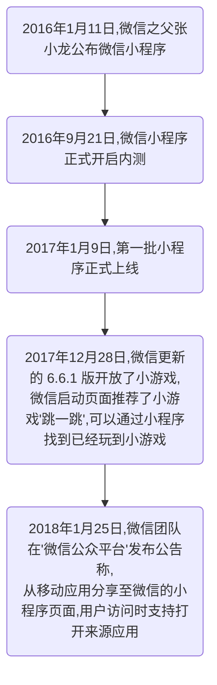

# 目录

[TOC]

# 一、知识路径

- 小程序基本介绍
- 帐号和设置
- 开发工具和模拟器
- 应用案例：实现第一个小程序
- 小程序的文件结构与配置
- 事件
- 视图结构wxml
- 小程序样式

==目标：能够注册小程序帐号，并且掌握小程序中的基本组成结构和相关语法==

# 二、今日课程内容

## 1、小程序基本介绍

### 1.1、小程序是什么？

官方文档：https://developers.weixin.qq.com/miniprogram/dev/

​	微信小程序，简称小程序，英文名 Mini Program，对于开发者而言，小程序开发门槛相对较低，难度不及APP，能够满足简单的基础应用，适合生活服务类线下商铺以及非刚需低频应用的转换。

### 1.2、发展历史

<!-- more -->

### 1.3、小程序与传统 APP 的区别

#### 1.3.1、小程序

局限性：必须依赖于微信，不能独立运行

优势：不需要考虑兼容问题，推广安装的问题。因为微信软件安装量中够多，开发难度小

#### 13.2、传统 APP

优势：独立运行，不需要依赖于谁，可以适合所有的业务需求

局限性：需要用户安装，解决适配(开发兼容问题)，开发难度大

### 1.4、怎么理解小程序？

- 不是HTML5
- 即用即走，随手可得
- 拥有离线能力
- 基于微信客户端中，一次开发，多端兼容
- 优美的操作体验

#### 1.4.1、谁可以注册开发小程序？

官方文档：https://mp.weixin.qq.com/cgi-bin/wx?token=&lang=zh_CN

#### 1.4.2、需要的技术储备？

- css知识
- 类似html语法(xml)、view视图层
- javascript 控制与逻辑层实现 model controller

### 1.5、小程序的框架结构

### 1.6、小程序开发者手册文档

官方文档：https://developers.weixin.qq.com/miniprogram/dev/index.html

## 2、帐号和设置

小程序是微信提供一种服务它明确的给出了使用小程序的接入流程

我们从流程中可以看到，第一步就需要注册帐号。

### 2.1、注册

#### 2.1.1、进入注册页面

官方文档：https://mp.weixin.qq.com/cgi-bin/wx?token=&lang=zh_CN

#### 2.1.2、填写注册信息

> ==注意：==
>
> ​	==1、一个邮箱只能申请一个小程序帐号==
>
> ​	==2、注册了公众号的邮箱不能再申请小程序==
>
> ​	==3、注册完成后，需要进入注册帐号的邮箱激活帐号==

### 2.2、登陆

#### 2.2.1、进入官网登陆页面

==注意：输入注册时的邮箱和密码进行登陆==

网址：https://mp.weixin.qq.com

==登陆后会被要求进行二次扫码验证登陆==，直接使用绑定的微信扫码登陆即可，二次验证成功后，进入如下所示界面：

#### 2.2.2、先完善个人信息

#### 2.2.3、完善个人信息后，即可查看推广的小程序码

### 2.3、获取 appid

注意：小程序开发，需要依赖于小程序的 appid ，我们可以通过如下图所示的操作，查看当前小程序的 appid

## 3、开发工具和模拟器

​	为了帮助开发者简单和高效地开发和调试微信小程序，腾讯在原有的公众号网页调试工具的基础上，推出了全新的微信开发者工具，集成了公众号网页调试和小程序调试两种开发模式。

### 3.1、下载安装官方开发工具

下载地址：http://t.cn/RrKI5a3

根据自己的操作系统，下载相应版本的软件，下载后，双击运行安装，一路下一步即可。

安装完成后，运行开发工具，会出现以下界面

使用之前绑定的微信号进行扫码，会出现以下界面：

点击小程序项目，出现如下界面：

到此，官方开发工具安装完成。

### 3.2、vscode开发工具【选装】

下载后，直接双击运行安装程序，一路下一步安装即可。

安装完成后，运行该软件，可以按下图所示安装中文包：

当前vscode还不支持小程序代码提示，所以要进一步安装相关vscode的插件

minapp插件：

wechat-snippet插件：

wepy snippet插件：

## 4、应用案例：实现第一个小程序

运行官方开发工具，先填写项目信息

点击确定，进入开发界面：

## 5、小程序的文件结构与配置

### 5.1、文件结构

一个小程序主体部分由三个文件组成，==必须放在项目的根目录==

| 文件名称 | 必需 | 作用                   |
| -------- | ---- | ---------------------- |
| app.js   | 是   | 小程序逻辑             |
| app.json | 是   | 小程序公共设置         |
| app.wxss | 否   | 小程序==公共==样式文件 |

比如当前我们的《第一个小程序》项目根目录下就存在这三个文件：

### 5.2、pages目录

项目根目录下的pages目录存放的是小程序中的页面，小程序每个页面都由4个文件组成(==注意：这四种文件必须是同名的==)， 分别为：

| 文件类型 | 必需 | 作用       |
| -------- | ---- | ---------- |
| js       | 是   | 页面逻辑   |
| wxml     | 是   | 页面结构   |
| wxss     | 否   | 页面样式表 |
| json     | 否   | 页面配置   |

例如：《第一个小程序》项目中的pages目录

例如：index页面文件夹中

### 5.3、小程序配置app.json

​	app.json文件用来对微信小程序进行全局配置，决定页面文件的路径、窗口表现、设置网络超时时间、设置多tab(底部导航菜单)等。

==注意：1）app.json中不能添加任何注释，否则会报错；2）字符串用户双引号引起来。==

上图中我们看到app.json中实际保存的是小程序的主配置项属性列表，app.json中可以设置的属性有以下几项：

| 属性           | 类型         | 必填 | 描述                    |
| -------------- | ------------ | ---- | ----------------------- |
| pages          | String Array | 是   | 设置页面路径            |
| window         | Object       | 否   | 设置默认页面的窗口表现  |
| tabBar         | Object       | 否   | 设置底部 tab 的表现     |
| networkTimeout | Object       | 否   | 设置网络超时时间        |
| debug          | Boolean      | 否   | 设置是否开启 debug 模式 |

#### 5.3.1、各项属性说明

##### 5.3.1.1、pages
##### 5.3.1.1、pages

值是一个数组，数组的每一项都字符串，用来指定小程序由哪些页面组成。每一项代表对应页面【==路径+文件名(不包含后缀名)==】的信息。数组的**第一项代表小程序的初始页面**。

==注意：小程序每新增一个页面，相应的在pages中就需要增加多一个配置页面记录；反之亦然。==

##### 5.3.1.2、window

用于设置小程序的状态栏、导航条、标题、窗口背景色。

| 属性                         | 类型     | 默认值  | 描述                                                         | 最低版本        |
| ---------------------------- | -------- | ------- | ------------------------------------------------------------ | --------------- |
| navigationBarBackgroundColor | HexColor | #000000 | 导航栏背景颜色，如："#000000"                                |                 |
| navigationBarTextStyle       | String   | white   | 导航栏标题颜色，仅支持black/white                            |                 |
| navigationBarTitleText       | String   |         | 导航栏标题文字内容                                           |                 |
| navigationStyle              | String   | default | 导航栏样式，仅支持 default/custom.custom 模式可自定义导航栏，只保留右上角胶襄状的按键 | 微信版本6.6.0   |
| backgroundColor              | HexColor | #ffffff | 窗口的背景色                                                 |                 |
| backgroundTextStyle          | String   | dark    | 下拉 loading 的样式，仅支持dark/light                        |                 |
| backgroundColorTop           | String   | #ffffff | 顶部窗口的背景色，仅 IOS支持                                 | 微信 版本6.5.16 |
| backgroundColorBottom        | String   | #ffffff | 底部窗口的背景色，仅 IOS支持                                 | 微信 版本6.5.16 |
| enablePullDownRefresh        | Boolean  | false   | 是否开启下拉刷新，详见页面相关事件处理 函数                  |                 |
| onReachBottomDistance        | Number   | 50      | 页面上拉触底事件触发时距页面底部距离，单位为px               |                 |

**示例：**

##### 5.3.1.3、tabBar

tabBar 支持的属性：

- 当设置 position 为 top 时，将不会显示 icon。
- tabBar 中的 list 是一个数组，只能配置==最少2个、最多5个tab==，tab 按数组的顺序排序。

| 属性            | 类型     | 必填 | 默认值 | 描述                                                   |
| --------------- | -------- | ---- | ------ | ------------------------------------------------------ |
| color           | HexColor | 是   |        | tab 上的文字默认颜色                                   |
| selectedColor   | HexColor | 是   |        | tab 上的文字选中时的颜色                               |
| backgroundColor | HexColor | 是   |        | tab 的背景色                                           |
| borderStyle     | String   | 否   | black  | tabbar 上边框的颜色，仅支持 black/white                |
| list            | Array    | 是   |        | tab 的列表，详见 list 属性说明，最少 2个、最多 5个 tab |
| position        | String   | 否   | bottom | 可选值 bottom、top                                     |

tabBar 中==list支持的属性==：

| 属性             | 类型   | 必填 | 说明                                                         |
| ---------------- | ------ | ---- | ------------------------------------------------------------ |
| pagePath         | String | 是   | 页面路径，必须在 pages 中先定义                              |
| text             | String | 是   | tab 上按钮文字                                               |
| iconPath         | String | 否   | 图片路径，icon 大小限制为 40kb，建议尺寸为 81px*81px，当 postion 为 top 时，此参数无效，不支持网络图片 |
| selectedIconPath | String | 否   | 选中时的图片路径，icon 大小限制为 40kb，建议尺寸为 81px*81px，当 postion 为 top 时，此参数无效 |
##### 5.3.1.4、networkTimeout

用于设置各种网络请求的超时时间

| 属性          | 类型   | 必填 | 说明                                                     |
| ------------- | ------ | ---- | -------------------------------------------------------- |
| request       | Number | 否   | wx.request 的超时时间，单位==毫秒==，默认为：60000       |
| connectSocket | Number | 否   | wx.connectSocket 的超时时间，单位==毫秒==，默认为：60000 |
| uploadFile    | Number | 否   | wx.uploadFile 的超时时间，单位==毫秒==，默认为：60000    |
| downloadFile  | Number | 否   | wx.downloadFile 的超时时间，单位==毫秒==，默认为：60000  |

==注意：上线之前一定要设置一下超时时间，不然小程序有可能出现上列情况。==

示例：

##### 5.3.1.5、debug

​	用于在开发者工具中开启 debug 模式，在开发者工具的控制台面板，调试信息以 info 的形式给出，其信息有 Page 的注册，页面路由，数据更新，事件触发。可以帮助开发者快速定位一些常见的问题，默认为开启状态。

==在开发阶段，建议打开 debug。上线时请关闭此选项，设置为 false。==

开发文档：https://developers.weixin.qq.com/miniprogram/dev/framework/config.html
## 6、生命周期（系统js事件）

==注意：以下内容都是写在 js 文件中的。==

### 6.1、onLoad( Object query )

当页面加载时触发。

参数说明：

​	类型：Objert

​	说明：打开当前页面路径中的参数

### 6.2、onShow()

​	当页面显示/切入前台时触发

### 6.3、onReady()

​	当页面初次渲染完成时触发。

​	当事件触发时，代表页面已经准备妥当，可以和视图层进行交互。

### 6.4、onHide()

​	当面隐藏/切入后台时触发。如： navigateTo 或底部 tab 切换到其他页面，小程序切入后台等。

### 6.5、onUnload()

​	当页面卸载时触发。

预知后事如何请听下文分解...