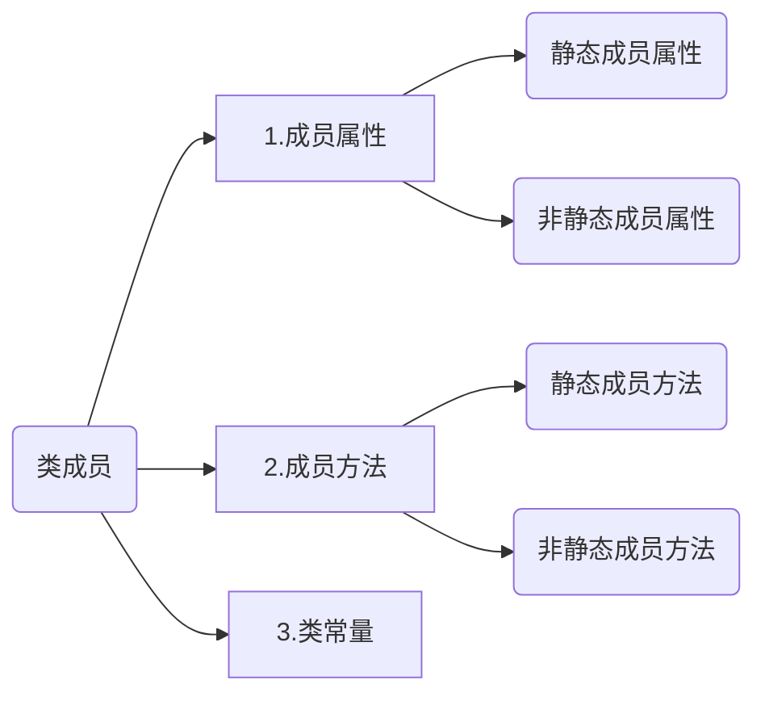

# 一、昨日回顾

## 1. 知识回顾

1. 能够使用多种方式创建画布资源

   imagecreate函数      根据指定的宽高（单位是像素）创建画布（建议单色系图像使用）

   imagecreatetruecolor函数     根据指定的宽高（单位是像素）创建真彩色画布（建议丰富色系图像使用）

   imagecreatefromjpeg函数    根据一张已有的jpeg格式图片创建画布

   imagecreatefromgif函数    根据一张已有的gif格式图片创建画布

   imagecreatefrompng函数    根据一张已有的png格式图片创建画布
<!-- more -->
2. 能够操作画布资源

   imagecolorallocate函数       分配颜色

   imagefill函数       填充颜色

   imageline函数       画线段（画点）

   imagerectangle函数      画矩形（画正方形）

   imagearc函数       画弧线段（椭圆，正圆）

   imagettftext函数      根据指定的ttf格式的字体来在画布上写字

3. 能够输出画布资源为图片文件或网页图

   imagejpeg函数        将画布以jpeg格式的图像输出到浏览器或者保存成文件

   imagegif函数       将画布以gif格式的图像输出到浏览器或者保存成文件

   imagepng函数        将画布以png格式的图像输出到浏览器或者保存成文件

4. 能够销毁画布资源

   imagedestroy函数


# 二、知识路径

- 面向对象相关概念

  ​	为什么使用面向对象

  ​	什么是面向对象

- PHP中的类与对象

  ​	类

  ​	类成员

  ​	对象

  ​	对象创建的原理

  ​	类成员的定义

  ​	类成员的调用

  ​		类的外部调用类成员

  ​		类的内部调用类成员

  ​	对象的比较

  ​	self关键字

  ​	构造方法

  ​	析构方法

  ​	对象的传值

  ​	对象的克隆

  ==目标：能够创建所有的类成员；能够实现在类的外部调用类成员；能够实现在类的内部调用类成员==


# 三、今日课程内容：面向对象

## 1. 面向对象相关概念

### 为什么使用面向对象

编程思想有两个大类：1）面向过程思想；2）面向对象思想；


#### 面向过程思想介绍

我们来看以下两个场景：

|                          |                          |
| ------------------------ | ------------------------ |
|  |  |


==**小结**==：

面向过程的思想：面向的是==整个过程==，强调的是过程中的每一个==动作==。


#### 面向对象思想介绍

同样是相同的两个场景，使用面向对象的方式来解决最终的问题：

|                          |                          |
| ------------------------ | ------------------------ |
|  |  |

==**小结**==：

面向对象的思想：面向的是==一个对象==，强调的是最终执行的 ==结果==。


#### 面向过程思想的局限性

1. 使用面向过程思想开发，代码冗余率高，重用性低；
2. 使用面向过程思想开发，如果中途需求发生改变，那么代码的改动量将会相当庞大。

 

正是由于有这些局限性，所以人们慢慢过渡到使用面向对象的方式来进行开发，解决上述局限性问题。

### 什么是面向对象

面向对象即==OOP== （Object Oriented Programming）

**==概念==**：以面向对象思想为指导的一种编程方式。


通俗的理解面向对象：==找个对象帮我做事==。


## 2. PHP中的类与对象

### 类

程序本质上就是对现实世界的模拟。

 

现实世界中的类是一个比较抽象的概念，比如人类，鱼类，车类等，它其实就是拥有相同特性的事物的统称；

程序当中也有类的概念。

 

现实当中类的概念：具有相同 ==特征== 和 ==行为== 的一类群体的统称。

PHP中的类的概念：具有相同 ==属性== 和 ==方法== 的一类事物的集合。


==**PHP中类的定义语法**==

```php
//定义一个类
class 类名{
    类成员
}
```


code1.php

```php
<?php

class Person{

}

echo '这是一个类定义的基本语法。';
```

访问code1.php的效果：


### 类成员

类成员包括==三个大类==：



定义一个完整的包含类成员的类：

```php
<?php

class Person{
    
    #成员属性
    public $v1='v1';//非静态成员属性
    public static $v2='v2';//静态成员属性

    #类常量
    const URL='www.home.com';

    #成员方法
    //非静态成员方法
    public function f1($name, $age){ 
        echo $name . ':' . $age;
    }

    //静态成员方法
    public static function f2(){ 
        echo 'f2';
    }
}

echo '这个类包含了所有的类成员！';
```


### 对象

对象需要基于类的定义创建出来。

**==创建对象的语法==**

```php
//需要先定义一个类
class demoA{
    
}

//然后再基于一个已有的类创建对象
$obj = new demoA;
```


code4.php

```php
<?php

//需要先定义一个类
class demoA{
    
}

//然后再基于一个已有的类创建对象
$obj = new demoA;

var_dump( $obj ); 

```

访问code4.php效果为：


### 类成员的定义

#### 成员属性

**==需求==**：定义名为Person的类，

1. 在Person类中定义一个非静态成员属性，名为"name"，值为"zhangsan"；
2. 在Person类中定义一个非静态成员属性，名为"age"，不指定值；
3. 在Person类中定义一个静态成员属性，名为"height"，值为"1.78"；
4. 在Person类中定义一个静态成员属性，名为"weight"，不指定值；

**==解答==**：构建名为code6.php的程序文件，代码如下：

```php
<?php

class Person{

    //非静态成员属性
    public $name='zhangsan';
    public $age;//不指定值

    //静态成员属性
    public static $height=1.78;
    public static $weight;//不指定值
}

echo '定义成员属性！';
```


**==小结==**：

1. 定义非静态成员属性的方式：就是在定义普通变量前加上public关键字，定义时可以不给该属性指定值。
2. 定义静态成员属性的方式：就是在定义非静态成员属性的语法基础上加多一个static关键字。


#### 成员方法

**==需求==**：定义名为Person的类，

1. 在Person类中定义一个名为singing的非静态成员方法，方法中输出"我会唱歌"；
2. 在Person类中定义一个名为dancing的静态成员方法，方法中输出"我会跳舞"；

**==解答==**：构建名为code7.php的程序文件，代码如下：

```php
<?php

class Person{

    //非静态成员方法
    public function singing(){ 
        echo '我会唱歌';
    }

    //静态成员方法
    public static function dancing(){ 
        echo '我会跳舞'; 
    }
}

echo '定义成员方法！';
```


**==小结==**：

1. 非静态成员方法的定义方式：在普通函数的结构基础上加上public关键字；
2. 静态成员方法的定义方式：在非静态成员方法的语法基础上加上static关键字；


#### 类常量

**==需求==**：定义名为Person的类，

1. 在Person类中定义一个类常量，名为"AREA"，值为"广东省广州市"；

**==解答==**：构建名为code8.php的程序文件，代码如下：

```php
<?php

class Person{

    //类常量
    const AREA='广东省广州市';
}

echo '定义类常量！';
```


**==小结==**：定义类常量的方式：就是const定义常量的写法写在了某个类中。


### 类成员的调用

#### 类的外部调用类成员

##### 成员属性

**==需求==**：定义名为Person的类，

1. 在Person类中定义一个非静态成员属性，名为"name"，值为"zhangsan"；
2. 在Person类中定义一个非静态成员属性，名为"age"，不指定值；
3. 在Person类中定义一个静态成员属性，名为"height"，值为"1.78"；
4. 在Person类中定义一个静态成员属性，名为"weight"，不指定值；
5. 实现在类的外部输出四个属性的值；

**==解答==**：构建名为code9.php的程序文件，代码如下：

```php
<?php

class Person{

    //非静态成员属性
    public $name='zhangsan';
    public $age;

    //静态成员属性
    public static $height=1.78;
    public static $weight;
}

#类的外部调用 静态成员属性
echo '类的外部调用静态成员属性：<br/>'; 
echo '$height属性：' . Person::$height . '<br/>';//使用类名加上固定的符号"::"再加上属性名（注意属性名包括$符号）
echo '$weight属性：'; var_dump( Person::$weight );

echo '<hr/>';

#类的外部访问 非静态成员属性
$obj = new Person;
echo '类的外部调用非静态成员属性：<br/>';
echo '$name属性：' . $obj->name . '<br/>';//使用对象加上固定的符号"->"再加上属性的名字（注意属性的名字不包括$符号）
echo '$age属性：'; var_dump( $obj->age ); 
```

访问code9.php，输出的内容为：

```mysql
类的外部调用静态成员属性：
$height属性：1.78
$weight属性：NULL

类的外部调用非静态成员属性：
$name属性：zhangsan
$age属性：NULL
```


**==小结==**：

1. 在类的外部调用非静态成员属性的方式：

    1）首先必须创建一个对象；

    2）然后使用这个对象加上固定的符号"==->=="再加上属性的属性名（==注意不包括$符号==）来进行访问；

2. 在类的外部调用静态成员属性的方式： 直接通过类名加固定的符号"::"再加上属性（==注意属性要包括$符号==）来进行调用；


==TIPS==： "::"这个符号我们专业的称为 ==范围解析操作符==。


##### 成员方法

**==需求==**：定义名为Person的类，

1. 在Person类中定义一个名为singing的非静态成员方法，方法中输出"我会唱歌"；
2. 在Person类中定义一个名为dancing的静态成员方法，方法中输出"我会跳舞"；
3. 实现在类的外部分别调用执行singing和dancing方法；

**==解答==**：构建名为code10.php的程序文件，代码如下：

```php
<?php

class Person{

    //非静态成员方法
    public function singing(){ 
        echo '我会唱歌'; 
    }

    //静态成员方法
    public static function dancing(){ 
        echo '我会跳舞'; 
    }
}

#类的外部调用 静态成员方法
Person::dancing();

echo '<hr/>';

#类的外部访问 非静态成员方法
$obj = new Person;
$obj->singing();
```

访问code10.php，输出的内容为：


**==小结==**：

1. 在类的外部调用非静态成员方法的方式：

   1）首先需要创建一个该类的对象；

   2）然后使用这个对象加上固定的符号"==->=="再加上方法名和小括号，有参数传参数来实现调用；

2. 在类的外部调用静态成员方法的方式：直接使用类名加上固定的符号"==::=="再加上方法名和小括号，有参数传参数来实现调用。

   


##### 类常量

**==需求==**：定义名为Person的类，

1. 在Person类中定义一个类常量，名为"AREA"，值为"广东省广州市"；
2. 实现在类的外部调用输出类常量；

**==解答==**：构建名为code11.php的程序文件，代码如下：

```php
<?php

class Person{

    //类常量
    const AREA='广东省广州市';
}

#类的外部调用类常量
echo Person::AREA;
```

访问code11.php，输出的内容为：


**==小结==**：类的外部调用类常量的方式： 直接使用类名加上固定的符号"==::=="再加上类常量名来实现访问；


##### **类的外部访问类成员总结**

1. 类的外部访问非静态成员（非静态成员属性和非静态成员方法）：

   ```php
   class A{
       
       public $var1='var1';//非静态成员属性
       public function f1(){//非静态成员方法
           echo 'f1';
       }
   }
   
   #第一步，必须先创建一个该类的对象
   $obj = new A;
   #第二步，使用对象来调用非静态成员
   //非静态成员属性
   echo $obj->var1;
   //非静态成员方法
   $obj->f1();
   ```

2. 类的外部访问静态成员（包括静态成员属性和静态成员方法）：

   ```php
   class A{
       
       public static $var1='var1';//静态成员属性
       public static function f1(){//静态成员方法
           echo 'f1';
       }
   }
   
   //调用静态成员属性
   echo A::$var1;
   //调用静态成员方法
   A::f1();
   ```

3. 类的外部访问类常量：

   ```php
   class A{
       //类常量
       const PATH='./source';
   }
   
   //调用类常量
   echo A::PATH;
   ```

   

#### 类的内部调用类成员

##### 成员属性

**==需求==**：定义名为Person的类，

1. 在Person类中定义一个非静态成员属性，名为"name"，值为"zhangsan"；
2. 在Person类中定义一个静态成员属性，名为"height"，值为"1.78"；
3. 在Person类中定义一个名为test的非静态成员方法，在test方法中实现输出"name"的值和"height"的值；
4. 在Person类中定义一个名为test_static的静态成员方法，在test_static方法中实现输出"height"的值，并且尝试输出"name"的值；

**==解答==**：构建名为code12.php的程序文件，代码如下：

```php
<?php

class Person{

    //非静态成员属性
    public $name='zhangsan';
    
    //静态成员属性
    public static $height=1.78;
    
    #测试在类的内部访问成员属性
    #非静态成员方法中访问
    public function test(){ 
        //非静态属性
        echo $this->name . '<br/>';
        //静态属性
        echo Person::$height;
    }

    #静态成员方法中访问
    public static function test_static(){ 
        //静态属性
        echo Person::$height;
        //非静态属性
        echo $this->name;
    }
}

$obj = new Person;
$obj->test();
echo '<hr/>';

Person::test_static();
```

访问code12.php，输出的内容为：


**==小结==**：

1. 类的内部访问非静态成员属性的方式：

   ```php
   #注意1:属性名不能加$符号
   #注意2:非静态属性只能在类的内部非静态方法里被访问到，不能在静态方法里访问到
   $this->属性名;  
   ```

   

2. 类的内部访问静态成员属性的方式：

   ```php
   #在类的内部访问静态成员属性和在类的外部访问静态成员属性的方式一模一样
   类名::$属性名;
   ```

   

##### 成员方法

**==需求==**：定义名为Person的类，

1. 在Person类中定义一个名为singing的非静态成员方法，方法中输出"我会唱歌"；
2. 在Person类中定义一个名为dancing的静态成员方法，方法中输出"我会跳舞"；
3. 在Person类中定义一个名为test的非静态成员方法，在test方法中调用singing和dancing方法；
4. 在Person类中定义一个名为test_static的静态成员方法，在test_static方法中实现dancing方法，并且尝试调用singing；

**==解答==**：构建名为code13.php的程序文件，代码如下：

```php
<?php

class Person{

    //非静态成员方法
    public function singing(){ 
        echo '我会唱歌';
    }
    //静态成员方法
    public static function dancing(){ 
        echo '我会跳舞'; 
    }
    
    #测试在类的内部访问成员方法
    #非静态成员方法中访问
    public function test(){ 
        //非静态方法
        $this->singing(); echo '<br/>';
        //静态方法
        Person::dancing();
    }

    #静态成员方法中访问
    public static function test_static(){ 
        //静态方法
        Person::dancing(); echo '<br/>';
        //非静态方法
        $this->singing(); 

    }
}

$obj = new Person;
$obj->test();
echo '<hr/>';

Person::test_static();
```

访问code13.php，输出的内容为：


**==小结==**：

1. 类的内部访问非静态方法：

   ```php
   #注意： 在类的内部静态方法里无法调用非静态方法
   $this->方法名([参数列表]);
   ```

   

2. 类的内部访问静态方法：

   ```php
   类名::方法名([参数列表]);
   ```

   

##### 类常量

**==需求==**：定义名为Person的类，

1. 在Person类中定义一个类常量，名为"AREA"，值为"广东省广州市"；
2. 在Person类中定义一个名为test的非静态成员方法，在test方法中输出类常量；
3. 在Person类中定义一个名为test_static的静态成员方法，在test_static方法中输出类常量；

**==解答==**：构建名为code14.php的程序文件，代码如下：

```php
<?php

class Person{

    //类常量
    const AREA='广东省广州市';
    
    #测试在类的内部访问成员方法
    #非静态成员方法中访问
    public function test(){ 
        echo Person::AREA; 
    }

    #静态成员方法中访问
    public static function test_static(){ 
        echo Person::AREA; 
    }
}

$obj = new Person;
$obj->test();
echo '<hr/>';

Person::test_static();
```

访问code14.php，输出的内容为：


**==小结==**：在类的内部访问类常量的方式：直接通过    ==类名::类常量名==   来进行访问。


==$this的含义==   哪个对象调用，就代表那个对象（空间）；


##### **类的内部调用类成员总结**

1. 类的内部访问非静态成员（非静态成员属性和非静态成员方法）：

   ```php
   $this->属性名     #访问非静态成员属性
   $this->方法名([参数列表]);     #访问非静态成员方法
   
   ##注意：在静态方法中不能访问非静态成员。
   ```

2. 类的内部访问静态成员（包括静态成员属性和静态成员方法）：

   ```php
   类名::属性名    #访问静态成员属性
   类名::方法名([参数列表]);    #访问静态成员方法
   ```

3. 类的内部访问类常量：

   ```php
   类名::类常量     #访问类常量
   ```


### 对象创建的原理

**==原理图==**：


**==小结==**：

1. 静态成员和类常量属于类；
2. 非静态成员属于对象（空间）；


### 对象的比较

在程序中，对象是保存在变量中的，变量之间可以使用"=="等于和"\=\=\="全等于进行比较，也就意味着对象也可以进行这两种比较。


**==需求==**：定义名为Person的类，

1. 在Person类中定义一个非静态成员属性，名为"name"，值为"zhangsan"；
2. 在类的外部分别对Person类创建两个对象；
3. 使用"=="等于 和  "\=\=\="全等于对两个对象进行比较，输出比较的结果；

**==解答==**：构建名为code15.php的程序文件，代码如下：

```php
<?php

class Person{

    public $var1=100;
    public $age=16;
}

$obj1 = new Person;
var_dump( $obj1 ); echo '<hr/>';

$obj2 = new Person;
var_dump( $obj2 ); echo '<hr/>';

#使用==做比较
$re = ($obj1==$obj2);
echo '使用==做比较：';
var_dump( $re ); echo '<hr/>';

#使用===做比较
$re = ($obj1===$obj2);
echo '使用===做比较：';
var_dump( $re ); 
```

访问code15.php，输出的内容为：


### self关键字

self关键字的**作用**是，在==本类的内部==**代替**==本类的类名==。


**==需求==**：定义名为Person的类，

1. 在Person类中定义一个静态成员属性，名为"name"，值为"zhangsan"；
2. 在Person类中定义一个类常量，名为"AREA"，值为"广东省广州市"；
3. 在Person类中定义一个名为test的非静态成员方法，在test方法中输出"name"的值和类常量的值；
4. 在Person类中定义一个名为test_static的静态成员方法，在test_static方法中输出"name"的值和类常量的值；

**==解答==**：构建名为code16.php的程序文件，代码如下：

```php
<?php

class Person{

    public static $name='zhangsan';
    const AREA='广东省广州市';

    //
    public function test(){ 
        echo Person::$name; echo '<br/>';
        echo Person::AREA; echo '<hr/>';echo '<hr/>';
        echo self::$name; echo '<br/>';
        echo self::AREA; 
    }

    //
    public static function test_static(){ 
        echo Person::$name; echo '<br/>';
        echo Person::AREA;  echo '<hr/>';echo '<hr/>';
        echo self::$name; echo '<br/>';
        echo self::AREA; 
    }
}
```

访问code16.php，输出的内容为：


**==小结==**：self只在==本类==的内部代替==本类==的类名；


### 构造方法

==**定义语法**==

```php
class 类名{
    //定义类中的构造方法
    public function __construct([形参列表]){
    	#方法体 和 返回值
	}
}
```


**==需求==**：不使用构造方法完成对属性的赋值操作，定义名为Person的类，

1. 在Person类中定义两个非静态成员属性，名分别为"name"和"age"，不指定值；
2. 在类的外部基于Person类创建两个对象，第一个对象设置name的值为"zhangsan"，age的值为12，打印该对象；第二个对象设置name的值为lisi，age的值为16，打印该对象；

**==解答==**：构建名为code18.php的程序文件，代码如下：

```php
<?php

class Person{

    public $name;
    public $age;
}

$zhangsan = new Person;
var_dump( $zhangsan ); echo '<br/>';
$zhangsan->name = 'zhangsan';
$zhangsan->age = 12;
var_dump( $zhangsan ); echo '<hr/>';

$lisi = new Person;
var_dump( $lisi ); echo '<br/>';
$lisi->name = 'lisi';
$lisi->age = 16;
var_dump( $lisi ); 

```

访问code18.php，输出的内容为：


**==小结==**：在上面这个案例中，我们每次实例化对象后，都会重新为该对象中的所有属性赋值，当前实例化了两次，所以我们做了两拨赋值操作，那么以后的项目中，属性将会不止2两个，实例化对象后赋值的操作将会大量存在，如果每次都像这样手动的去赋值，显而易见工作效率将会及其低下，那么怎么办呢？


在PHP中，提供了一种非常便利的方式，可供我们无需做这么多的重复操作就能够达到每次实例化完成就直接为属性赋好值的操作，这个操作需要使用到PHP中类的构造方法！


**==需求==**：使用构造方法完成对属性的赋值操作，定义名为Person的类，

1. 在Person类中定义两个非静态成员属性，名分别为"name"和"age"，不指定值；
2. 在类的外部基于Person类创建两个对象，第一个对象设置name的值为"zhangsan"，age的值为12，打印该对象；第二个对象设置name的值为lisi，age的值为16打印该对象；

**==解答==**：构建名为code19.php的程序文件，代码如下：

```php
<?php

class Person{

    public $name;
    public $age;

    public function __construct($v1, $v2){ 
        $this->name = $v1;
        $this->age = $v2;
    }
}

$zhangsan = new Person('zhangsan', 12);
var_dump( $zhangsan ); echo '<hr/>';

$lisi = new Person('lisi', 16);
var_dump( $lisi ); 
```

访问code19.php，输出的内容为：


**==小结==**：

1. 构造方法的结构是固定的：

   ```php
   public function __construct([参数列表]){
       方法体
   }
   ```

2. PHP不负责定义构造方法，只负责调用构造方法；

3. PHP调用构造方法的实际时：当new一个对象时，将会触发PHP自动调用执行该类中的构造方法执行一次。


#### 老版本的构造方法

**说明**：在php中，早期版本的构造方法的方法名与所在类的类名一致。


**==需求==**：使用老版本的构造方法完成对属性的赋值操作，定义名为Person的类，

1. 在Person类中定义两个非静态成员属性，名分别为"name"和"age"，不指定值；
2. 在类的外部基于Person类创建两个对象，第一个对象设置name的值为"zhangsan"，age的值为12，打印该对象；第二个对象设置name的值为lisi，age的值为16打印该对象；

**==解答==**：构建名为code20.php的程序文件，代码如下：

```php
<?php

class Person{

    public $name;
    public $age;

    public function Person($v1, $v2){ 
        $this->name = $v1;
        $this->age = $v2;
    }
}

$zhangsan = new Person('zhangsan', 12);
var_dump( $zhangsan ); echo '<hr/>';

$lisi = new Person('lisi', 16);
var_dump( $lisi ); 
```

访问code20.php，输出的内容为：


**==小结==**：老版本的构造方法不建议使用。


### 析构方法

==**定义语法**==

```php
class 类名{
    //定义类中的析构方法（不能携带形参）
    public function __destruct(){
    	#方法体
	}
}
```


**==需求==**：定义名为Person的类，

1. 在Person类中定义1个非静态成员属性，名为"link"，不指定值；
2. 在Person类中定义1个构造方法，实现创建一个画布，并且将创建的画布资源保存给"link"；
3. 在类的外部创建2个基于Person类的对象，将2个对象打印出来；
4. 然后使用unset删除第一个创建的对象，查看最终效果；

**==解答==**：构建名为code21.php的程序文件，代码如下：

```php
<?php

class Person{

    public $link;

    public function __construct(){ 
        $this->link = imagecreate(300, 200);
    }

    //析构方法  当对象被销毁时，将会触发PHP自动调用执行
    public function __destruct(){ 
        echo 'bye~';
    }
}

$obj1 = new Person;
var_dump( $obj1 ); echo '<hr/>';

$obj2 = new Person;
var_dump( $obj2 ); echo '<hr/>';

unset($obj1); echo '<br/>';
```

访问code21.php，输出的内容为：


**==小结==**：在程序中，销毁对象的方式有两种：

1. 手动通过unset删除掉保存对象的变量，以达到销毁对象的目的；
2. 程序执行结束，保存对象的变量也将会被自动销毁，间接的触发了对象的销毁；

析构方法的特点：

1. PHP不负责定义析构方法，只负责调用析构方法；
2. PHP调用析构方法的时机是：当对象被销毁时，将会触发PHP自动调用执行析构方法一次。


### 对象的传值

在程序中，对象是保存在变量中的，变量存在值传递和引用传递，所以对象也就存在值传递和引用传递。 


#### 对象的引用传递与对象的值传递的效果

**==需求1==**：实现对象的引用传递，定义名为Person的类，

1. 在Person类中定义1个非静态成员属性，名为"name"，值为"zhangsan"；
2. 在类的外部创建第一个基于Person类的对象保存到变量$obj1中，将$obj1以引用传递赋值的方式赋值给$obj2变量，分别将两个对象都打印出来；
3. 改变$obj2中的name值为lisi，再次将两个对象打印出来，查看最终效果；

**==解答1==**：构建名为code22.php的程序文件，代码如下：

```php

```

访问code22.php，输出的内容为：


**==小结==**：


**==需求1==**：实现对象的值传递，定义名为Person的类，

1. 在Person类中定义1个非静态成员属性，名为"name"，值为"zhangsan"；
2. 在类的外部创建第一个基于Person类的对象保存到变量$obj1中，将$obj1以值传递赋值的方式赋值给$obj2变量，分别将两个对象都打印出来；
3. 改变$obj2中的name值为lisi，再次将两个对象打印出来，查看最终效果；

**==解答1==**：构建名为code23.php的程序文件，代码如下：

```php

```

访问code23.php，输出的内容为：


**==小结==**：


#### 对象的引用传递与对象的值传递的原理

对象的引用传递 原理图：


对象的值传递 原理图：


**==小结==**：


所以，到目前为止，我们掌握的技术手段中，能够得到一个全新对象的方式有一种，通过new关键字来实例化出全新的对象。那么，在PHP中，还有没有其他的方式也能够得到全新的对象呢？


### 对象的克隆

==克隆语法==：

```php
class A{}
$obj1 = new A;

#基于一个已有的对象克隆出一个新的对象操作如下
$obj2 = clone $obj1;
```


**==需求1==**：定义名为soldierPig的类，

1. 在soldierPig类中定义4个非静态成员属性，名分别为"name、blood、defence、attack"，不指定值；
2. 在soldierPig类中定义一个构造方法，实现对4个属性的自动赋值；
3. 在类的外部使用实例化的方式创建一个基于soldierPig类的对象，保存到$z_boss中，值分别为：（烈火，10000， 2000， 1000）；
4. 在类的外部使用实例化的方式创建一个基于soldierPig类的对象，保存到$z1中，值分别为：（野猪，1000， 200， 100）；
5. 基于$z1克隆出$z2、$z3对象，同时改名为野猪1和野猪2；

**==解答1==**：构建名为codex1.php的程序文件，代码如下：

```

```

访问codex1.php，输出的内容为：

```

```


**==小结==**：


**提问**：上面这个案例中，每次克隆后都需要手动改名，比较麻烦，有没有方法能够让我们在克隆的同时就自动按照设定好的规则将名字进行修改呢？

### __clone魔术方法

==定义语法==：

```php
class 类名{
    
    public function __clone(){
        #方法体
    }
}
```


**==需求1==**：使用克隆魔术方法实现自动改名，定义名为soldierPig的类，

1. 在soldierPig类中定义4个非静态成员属性，名分别为"name、blood、defence、attack"，不指定值；
2. 在soldierPig类中定义一个构造方法，实现对4个属性的自动赋值；
3. 在类的外部使用实例化的方式创建一个基于soldierPig类的对象，保存到$z1中，值分别为：（野猪，1000， 200， 100）；
4. 基于$z1克隆出$z2、$z3对象，同时实现自动改名为野猪1和野猪2；

**==解答1==**：构建名为codex1.php的程序文件，代码如下：

```

```

访问codex1.php，输出的内容为：

```

```


**==小结==**：


## 3. 全天总结

1. 类成员的分类？

   类成员分为  1）成员属性； 2）成员方法； 3）类常量

   成员属性：1）静态成员属性   2）非静态成员属性

   成员方法：1）静态成员方法  2）非静态成员方法

   类常量

2. 类成员的定义？

   ```php
   class A{
       
       #成员属性
       //静态成员属性
       public static $var1;
       //非静态成员属性
       public $var2;
       
       #类常量
       const URL='www.itcast.cn';
       
       #成员方法
       //静态成员方法
       public static function f1(){
           
           方法体
       }
       //非静态成员方法
       public function f2(){
           
           方法体
       }
   }
   ```

   

3. 类成员的调用？

   类的外部调用

   ```php
   class A{
       
       #成员属性
       //静态成员属性
       public static $var1='var1';
       //非静态成员属性
       public $var2='var2';
       
       #类常量
       const URL='www.itcast.cn';
       
       #成员方法
       //静态成员方法
       public static function f1(){
           
           方法体
       }
       //非静态成员方法
       public function f2(){
           
           方法体
       }
   }
   
   #类的外部调用
   //非静态成员（属性和方法）
   $obj = new A;
   echo $obj->var2;//非静态成员属性
   $obj->f2();//非静态成员方法
   
   //静态成员（属性和方法）
   echo A::$var1;//静态成员属性
   A::f1();//静态成员方法
   
   //类常量
   echo A::URL;
   ```

   类的内部调用

   ```PHP
   class A{
       
       #成员属性
       //静态成员属性
       public static $var1='var1';
       //非静态成员属性
       public $var2='var2';
       
       #类常量
       const URL='www.itcast.cn';
       
       #成员方法
       //静态成员方法
       public static function f1(){
           
           方法体
       }
       //非静态成员方法
       public function f2(){
           
           方法体
       }
      	##类的内部调用
       #在非静态测试方法中
       public function text(){
           //非静态成员属性
          	echo $this->var2;
           //静态成员属性
           echo A::$var1;
           echo self::$var1;
           //非静态成员方法
           $this->f2();
           //静态成员方法
           A::f1();
           self::f1();
           //类常量
           echo A::URL;
           echo self::URL;
       }
       #在静态测试方法中
       public static function text_static(){
           
           //静态成员属性
           echo A::$var1;
           echo self::$var1;
           //静态成员方法
           A::f1();
           self::f1();
           //类常量
           echo A::URL;
           echo self::URL;
       }
   }
   
   //调用非静态测试方法
   $obj = new A;
   $obj->test();
   
   //调用静态测试方法
   A::test_static();
   ```

   

4. 构造方法？

   ```php
   class 类名{
       
       public function __construct([形参列表]){
           
           方法体
       } 
   }
   ```

   

5. 析构方法？

   ```php
   class 类名{
       
       public function __destruct(){
           
           方法体
       }
   }
   ```

   


